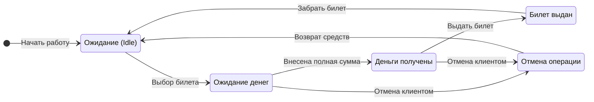

Акторы и События (Триггеры)
Событие 1: SelectTicket (Выбор билета)

Событие 2: InsertMoney (Внесение денег)

Событие 3: DispenseTicket (Выдача билета)

Событие 4: CancelTransaction (Отмена транзакции)
