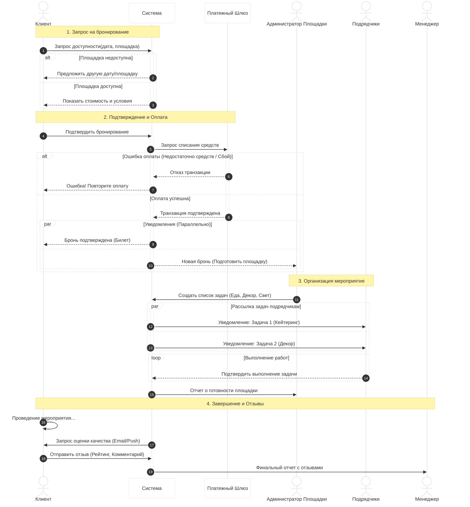

```mermaid
%%{init: {'theme': 'base', 'themeVariables': { 'primaryColor': '#ffffff', 'edgeLabelBackground':'#fff', 'tertiaryColor': '#fff'}}}%%
sequenceDiagram
    autonumber
    
    actor Client as Клиент
    participant System as Система
    participant Gateway as Платежный Шлюз
    actor Admin as Администратор Площадки
    actor Contractor as Подрядчики
    actor Manager as Менеджер

    Note over Client, System: 1. Запрос на бронирование

    Client->>System: Запрос доступности(дата, площадка)
    activate System
    
    alt Площадка недоступна
        System-->>Client: Предложить другую дату/площадку
    else Площадка доступна
        System-->>Client: Показать стоимость и условия
    end
    deactivate System

    Note over Client, Gateway: 2. Подтверждение и Оплата

    Client->>System: Подтвердить бронирование
    activate System
    System->>Gateway: Запрос списания средств
    activate Gateway
    
    alt Ошибка оплаты (Недостаточно средств / Сбой)
        Gateway-->>System: Отказ транзакции
        System-->>Client: Ошибка! Повторите оплату
    else Оплата успешна
        Gateway-->>System: Транзакция подтверждена
        deactivate Gateway
        
        par Уведомления (Параллельно)
            System-->>Client: Бронь подтверждена (Билет)
        and
            System-->>Admin: Новая бронь (Подготовить площадку)
        end
    end
    deactivate System

    Note over Admin, Contractor: 3. Организация мероприятия

    Admin->>System: Создать список задач (Еда, Декор, Свет)
    activate System
    
    par Рассылка задач подрядчикам
        System->>Contractor: Уведомление: Задача 1 (Кейтеринг)
    and
        System->>Contractor: Уведомление: Задача 2 (Декор)
    end
    deactivate System

    loop Выполнение работ
        Contractor-->>System: Подтвердить выполнение задачи
    end

    System->>Admin: Отчет о готовности площадки

    Note over Client, Manager: 4. Завершение и Отзывы

    Client->>Client: Проведение мероприятия...
    
    System->>Client: Запрос оценки качества (Email/Push)
    Client->>System: Отправить отзыв (Рейтинг, Комментарий)
    activate System
    System->>Manager: Финальный отчет с отзывами
    deactivate System

```
