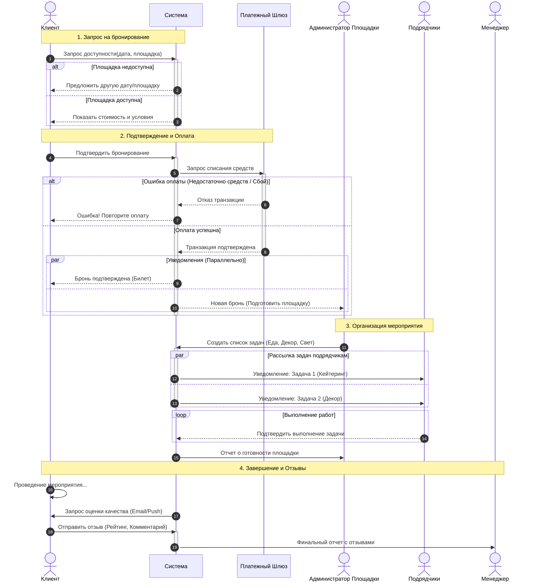

Диаграмма разбита на 4 ключевых этапа:

Поиск и выбор (Alternative):
            Клиент инициирует процесс запросом.
            Используется блок alt (альтернатива) для проверки доступности. Если дата занята, сценарий идет по ветке отказа, иначе — переходит к предложению цены.

Финансы (Alternative + Parallel):
            Самый критичный участок. Система обращается к внешнему Платежному шлюзу.
            В случае успеха (else Оплата успешна) используется блок par (параллельное выполнение): Система одновременно отправляет билет клиенту и уведомление администратору. Это важно, чтобы         администратор узнал о брони сразу, не дожидаясь, пока клиент прочитает письмо.

Логистика (Parallel + Loop):
            Администратор создает задачи. Система рассылает их подрядчикам параллельно (par), так как декораторы и кейтеринг работают независимо.
            Используется цикл loop, подразумевающий, что подрядчики могут присылать подтверждения в разное время и по частям.

Обратная связь:
            Пост-процесс. Система автоматически запрашивает отзыв, и после получения данных формирует отчет для Менеджера.

