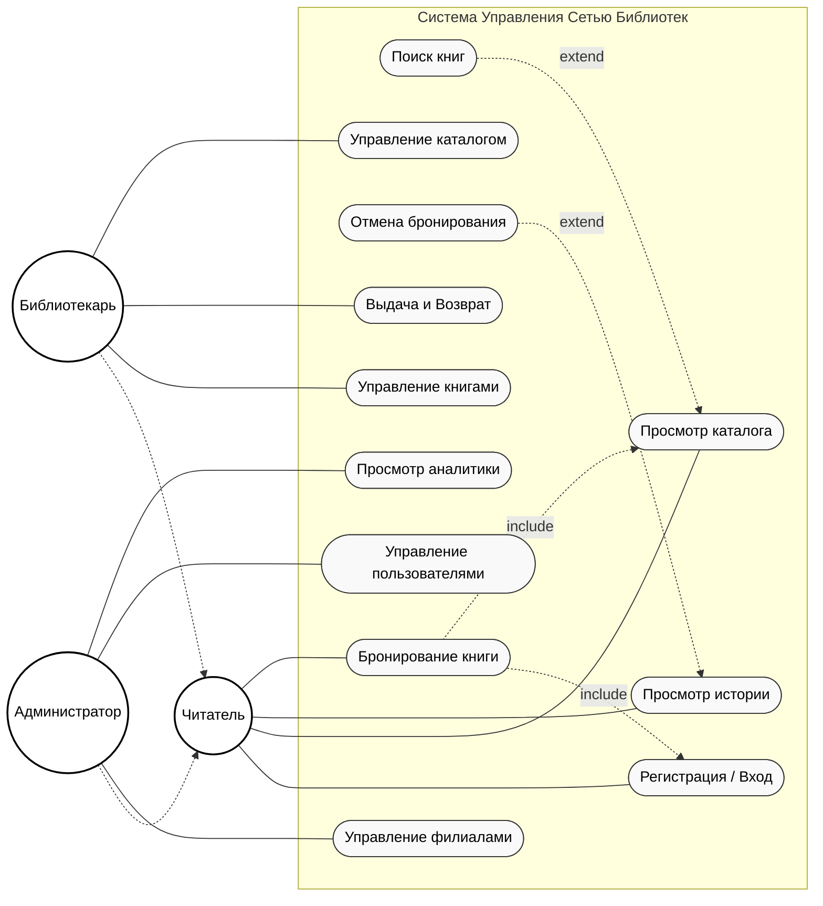

 Иерархия акторов (Наследование): На диаграмме использована стрелка с пустым треугольником (<|--), указывающая на родителя.
Читатель — базовый актер.
Библиотекарь и Администратор наследуются от Читателя. Это означает, что сотрудник библиотеки или админ тоже могут искать книги и просматривать каталог как обычные пользователи, но имеют дополнительные права.

Типы связей:
<<include>> (Включение):
Пример: Бронирование книги ..> Вход в систему
Логика: Невозможно забронировать книгу, если система не знает, кто вы. Процесс бронирования всегда включает в себя идентификацию пользователя.

<<extend>> (Расширение):
Пример: Поиск книг ..> Просмотр каталога.
 Пользователь может просто листать каталог (базовый сценарий). Использование строки поиска — это опциональное расширение этого процесса, оно происходит не всегда.
Пример: Отмена бронирования ..> Просмотр истории. Отмена происходит только в контексте просмотра списка своих активных заявок.
