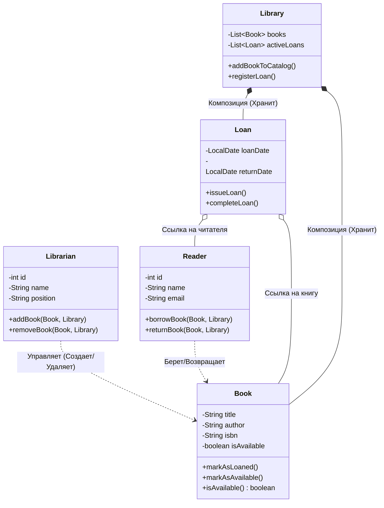

```mermaid
classDiagram
    class Book {
        -String title
        -String author
        -String isbn
        -boolean isAvailable
        +markAsLoaned()
        +markAsAvailable()
        +isAvailable() boolean
    }

    class Reader {
        -int id
        -String name
        -String email
        +borrowBook(Book, Library)
        +returnBook(Book, Library)
    }

    class Librarian {
        -int id
        -String name
        -String position
        +addBook(Book, Library)
        +removeBook(Book, Library)
    }

    class Loan {
        -LocalDate loanDate
        -
        LocalDate returnDate
        +issueLoan()
        +completeLoan()
    }
    
    class Library {
        -List~Book~ books
        -List~Loan~ activeLoans
        +addBookToCatalog()
        +registerLoan()
    }

    Librarian ..> Book : Управляет (Создает/Удаляет)
    
    Reader ..> Book : Берет/Возвращает
    
    Loan o-- Book : Ссылка на книгу
    Loan o-- Reader : Ссылка на читателя
    
    Library *-- Book : Композиция (Хранит)
    Library *-- Loan : Композиция (Хранит)
```
